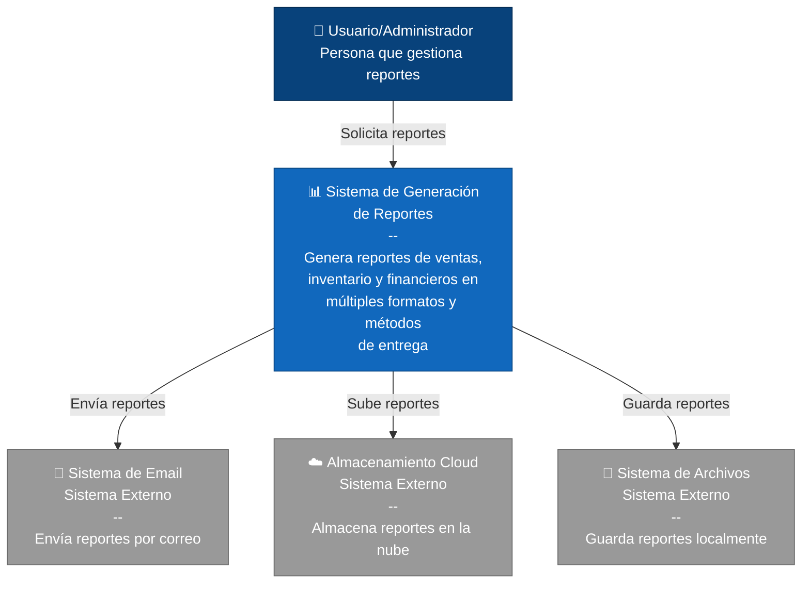
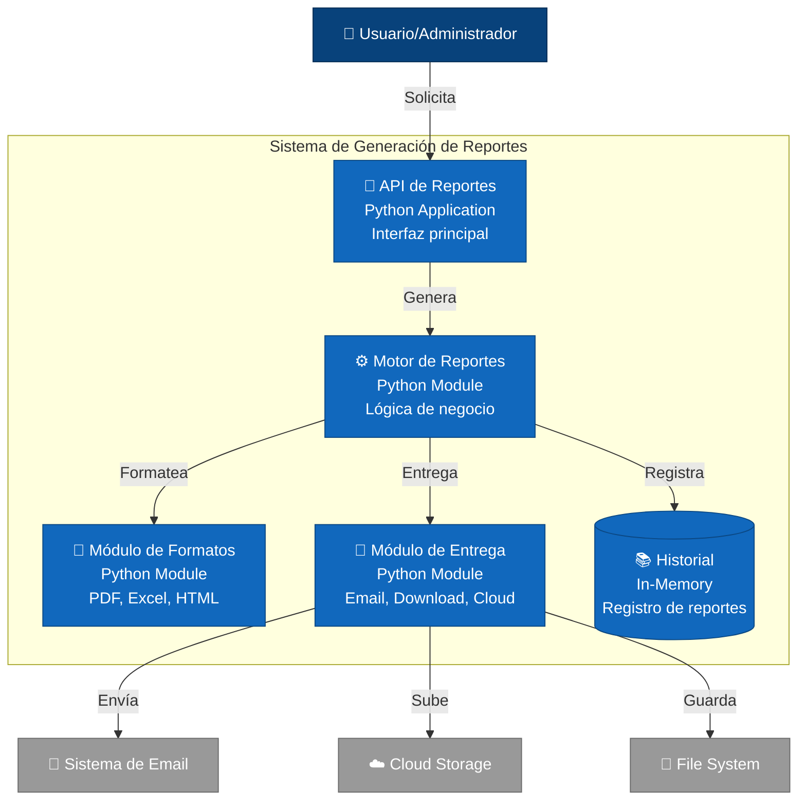
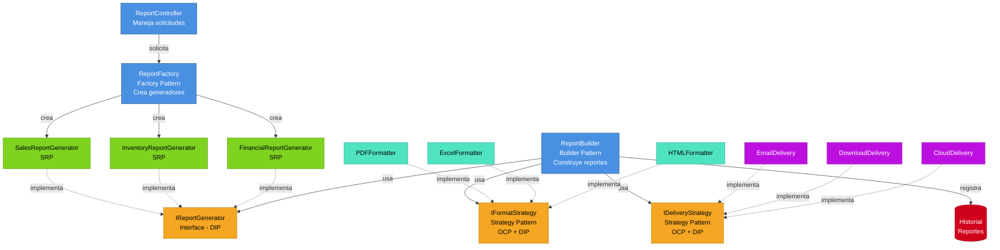

# EXAMEN 2
## DIAGRAMAS GESTOR DE DOCUMENTOS
### C1


```mermaid
graph TB
    User[👤 Usuario/Administrador<br/>Persona que gestiona reportes]
  
    System[📊 Sistema de Generación<br/>de Reportes<br/>--<br/>Genera reportes de ventas,<br/>inventario y financieros en<br/>múltiples formatos y métodos<br/>de entrega]
  
    EmailSystem[📧 Sistema de Email<br/>Sistema Externo<br/>--<br/>Envía reportes por correo]
  
    CloudStorage[☁️ Almacenamiento Cloud<br/>Sistema Externo<br/>--<br/>Almacena reportes en la nube]
  
    FileSystem[💾 Sistema de Archivos<br/>Sistema Externo<br/>--<br/>Guarda reportes localmente]
  
    User -->|Solicita reportes| System
    System -->|Envía reportes| EmailSystem
    System -->|Sube reportes| CloudStorage
    System -->|Guarda reportes| FileSystem
  
    style System fill:#1168bd,stroke:#0b4884,color:#ffffff
    style User fill:#08427b,stroke:#052e56,color:#ffffff
    style EmailSystem fill:#999999,stroke:#6b6b6b,color:#ffffff
    style CloudStorage fill:#999999,stroke:#6b6b6b,color:#ffffff
    style FileSystem fill:#999999,stroke:#6b6b6b,color:#ffffff
```

### C2


```mermaid
graph TB
    User["👤 Usuario/Administrador"]
  
    subgraph Sistema["Sistema de Generación de Reportes"]
        API["🔌 API de Reportes<br/>Python Application<br/>Interfaz principal"]
  
        Engine["⚙️ Motor de Reportes<br/>Python Module<br/>Lógica de negocio"]
  
        Format["📄 Módulo de Formatos<br/>Python Module<br/>PDF, Excel, HTML"]
  
        Delivery["📮 Módulo de Entrega<br/>Python Module<br/>Email, Download, Cloud"]
  
        DB[("📚 Historial<br/>In-Memory<br/>Registro de reportes")]
    end
  
    Email["📧 Sistema de Email"]
    Cloud["☁️ Cloud Storage"]
    Files["💾 File System"]
  
    User -->|Solicita| API
    API -->|Genera| Engine
    Engine -->|Formatea| Format
    Engine -->|Entrega| Delivery
    Engine -->|Registra| DB
  
    Delivery -->|Envía| Email
    Delivery -->|Sube| Cloud
    Delivery -->|Guarda| Files
  
    style API fill:#1168bd,stroke:#0b4884,color:#ffffff
    style Engine fill:#1168bd,stroke:#0b4884,color:#ffffff
    style Format fill:#1168bd,stroke:#0b4884,color:#ffffff
    style Delivery fill:#1168bd,stroke:#0b4884,color:#ffffff
    style DB fill:#1168bd,stroke:#0b4884,color:#ffffff
    style User fill:#08427b,stroke:#052e56,color:#ffffff
    style Email fill:#999999,stroke:#6b6b6b,color:#ffffff
    style Cloud fill:#999999,stroke:#6b6b6b,color:#ffffff
    style Files fill:#999999,stroke:#6b6b6b,color:#ffffff  
```

### C3


```mermaid

graph TB
    Controller["ReportController<br/>Maneja solicitudes"]
  
    Factory["ReportFactory<br/>Factory Pattern<br/>Crea generadores"]
  
    Builder["ReportBuilder<br/>Builder Pattern<br/>Construye reportes"]
  
    IGen["IReportGenerator<br/>Interface - DIP"]
  
    Sales["SalesReportGenerator<br/>SRP"]
  
    Inventory["InventoryReportGenerator<br/>SRP"]
  
    Financial["FinancialReportGenerator<br/>SRP"]
  
    IFormat["IFormatStrategy<br/>Strategy Pattern<br/>OCP + DIP"]
  
    PDF["PDFFormatter"]
  
    Excel["ExcelFormatter"]
  
    HTML["HTMLFormatter"]
  
    IDelivery["IDeliveryStrategy<br/>Strategy Pattern<br/>OCP + DIP"]
  
    Email["EmailDelivery"]
  
    Download["DownloadDelivery"]
  
    Cloud["CloudDelivery"]
  
    DB[("Historial<br/>Reportes")]
  
    Controller -->|solicita| Factory
    Factory -->|crea| Sales
    Factory -->|crea| Inventory
    Factory -->|crea| Financial
  
    Sales -.->|implementa| IGen
    Inventory -.->|implementa| IGen
    Financial -.->|implementa| IGen
  
    Builder -->|usa| IGen
    Builder -->|usa| IFormat
    Builder -->|usa| IDelivery
    Builder -->|registra| DB
  
    PDF -.->|implementa| IFormat
    Excel -.->|implementa| IFormat
    HTML -.->|implementa| IFormat
  
    Email -.->|implementa| IDelivery
    Download -.->|implementa| IDelivery
    Cloud -.->|implementa| IDelivery
  
    style Controller fill:#4A90E2,stroke:#2E5C8A,color:#fff
    style Factory fill:#4A90E2,stroke:#2E5C8A,color:#fff
    style Builder fill:#4A90E2,stroke:#2E5C8A,color:#fff
  
    style IGen fill:#F5A623,stroke:#C17D11,color:#000
    style IFormat fill:#F5A623,stroke:#C17D11,color:#000
    style IDelivery fill:#F5A623,stroke:#C17D11,color:#000
  
    style Sales fill:#7ED321,stroke:#5FA319,color:#000
    style Inventory fill:#7ED321,stroke:#5FA319,color:#000
    style Financial fill:#7ED321,stroke:#5FA319,color:#000
  
    style PDF fill:#50E3C2,stroke:#3AB09E,color:#000
    style Excel fill:#50E3C2,stroke:#3AB09E,color:#000
    style HTML fill:#50E3C2,stroke:#3AB09E,color:#000
  
    style Email fill:#BD10E0,stroke:#9012AB,color:#fff
    style Download fill:#BD10E0,stroke:#9012AB,color:#fff
    style Cloud fill:#BD10E0,stroke:#9012AB,color:#fff
  
    style DB fill:#D0021B,stroke:#A00116,color:#fff
```

### C4


```mermaid
classDiagram
    %% Interfaces (Principio DIP)
    class IReportGenerator {
        <<interface>>
        +generate(data: dict) Report
    }
  
    class IFormatStrategy {
        <<interface>>
        +format(content: str) str
    }
  
    class IDeliveryStrategy {
        <<interface>>
        +deliver(report: str, metadata: dict) bool
    }
  
    %% Generadores de Reportes (Principio SRP)
    class SalesReportGenerator {
        -report_type: str
        +generate(data: dict) Report
        -calculate_totals(sales: list) float
        -format_sales_detail(sales: list) str
    }
  
    class InventoryReportGenerator {
        -report_type: str
        +generate(data: dict) Report
        -calculate_totals(items: list) int
        -group_by_category(items: list) dict
    }
  
    class FinancialReportGenerator {
        -report_type: str
        +generate(data: dict) Report
        -calculate_balance(income: float, expenses: float) float
    }
  
    %% Estrategias de Formato (Patrón Strategy + OCP)
    class PDFFormatter {
        +format(content: str) str
    }
  
    class ExcelFormatter {
        +format(content: str) str
    }
  
    class HTMLFormatter {
        +format(content: str) str
    }
  
    %% Estrategias de Entrega (Patrón Strategy + OCP)
    class EmailDelivery {
        -smtp_config: dict
        +deliver(report: str, metadata: dict) bool
        -send_email(recipient: str, content: str) bool
    }
  
    class DownloadDelivery {
        -download_path: str
        +deliver(report: str, metadata: dict) bool
        -save_file(filename: str, content: str) bool
    }
  
    class CloudDelivery {
        -cloud_config: dict
        +deliver(report: str, metadata: dict) bool
        -upload_to_cloud(filename: str, content: str) bool
    }
  
    %% Factory (Patrón Factory)
    class ReportFactory {
        -generators: dict
        +create_generator(report_type: str) IReportGenerator
        +register_generator(type: str, generator: IReportGenerator)
    }
  
    %% Builder (Patrón Builder)
    class ReportBuilder {
        -generator: IReportGenerator
        -formatter: IFormatStrategy
        -delivery: IDeliveryStrategy
        -data: dict
        +set_generator(generator: IReportGenerator) ReportBuilder
        +set_formatter(formatter: IFormatStrategy) ReportBuilder
        +set_delivery(delivery: IDeliveryStrategy) ReportBuilder
        +set_data(data: dict) ReportBuilder
        +build() Report
    }
  
    %% Clase Principal
    class ReportSystem {
        -factory: ReportFactory
        -builder: ReportBuilder
        -report_history: list
        +generate_report(type: str, data: dict, format: str, delivery: str) Report
        +get_report_history() list
        -log_report(report: Report)
    }
  
    %% Modelo de Datos
    class Report {
        -content: str
        -type: str
        -format: str
        -timestamp: datetime
        -metadata: dict
        +get_content() str
        +get_metadata() dict
    }
  
    %% Relaciones
    IReportGenerator <|.. SalesReportGenerator
    IReportGenerator <|.. InventoryReportGenerator
    IReportGenerator <|.. FinancialReportGenerator
  
    IFormatStrategy <|.. PDFFormatter
    IFormatStrategy <|.. ExcelFormatter
    IFormatStrategy <|.. HTMLFormatter
  
    IDeliveryStrategy <|.. EmailDelivery
    IDeliveryStrategy <|.. DownloadDelivery
    IDeliveryStrategy <|.. CloudDelivery
  
    ReportFactory --> IReportGenerator : creates
    ReportBuilder --> IReportGenerator : uses
    ReportBuilder --> IFormatStrategy : uses
    ReportBuilder --> IDeliveryStrategy : uses
    ReportBuilder --> Report : builds
  
    ReportSystem --> ReportFactory : uses
    ReportSystem --> ReportBuilder : uses
    ReportSystem --> Report : manages

```

## DIAGRAMAS DE TIENDA EN LINEA
### C1

```mermaid