```mermaid
graph TB
    User[👤 Usuario/Administrador<br/>Persona que gestiona reportes]
  
    System[📊 Sistema de Generación<br/>de Reportes<br/>--<br/>Genera reportes de ventas,<br/>inventario y financieros en<br/>múltiples formatos y métodos<br/>de entrega]
  
    EmailSystem[📧 Sistema de Email<br/>Sistema Externo<br/>--<br/>Envía reportes por correo]
  
    CloudStorage[☁️ Almacenamiento Cloud<br/>Sistema Externo<br/>--<br/>Almacena reportes en la nube]
  
    FileSystem[💾 Sistema de Archivos<br/>Sistema Externo<br/>--<br/>Guarda reportes localmente]
  
    User -->|Solicita reportes| System
    System -->|Envía reportes| EmailSystem
    System -->|Sube reportes| CloudStorage
    System -->|Guarda reportes| FileSystem
  
    style System fill:#1168bd,stroke:#0b4884,color:#ffffff
    style User fill:#08427b,stroke:#052e56,color:#ffffff
    style EmailSystem fill:#999999,stroke:#6b6b6b,color:#ffffff
    style CloudStorage fill:#999999,stroke:#6b6b6b,color:#ffffff
    style FileSystem fill:#999999,stroke:#6b6b6b,color:#ffffff
```

```mermaid
graph TB
    User["👤 Usuario/Administrador"]
  
    subgraph Sistema["Sistema de Generación de Reportes"]
        API["🔌 API de Reportes<br/>Python Application<br/>Interfaz principal"]
  
        Engine["⚙️ Motor de Reportes<br/>Python Module<br/>Lógica de negocio"]
  
        Format["📄 Módulo de Formatos<br/>Python Module<br/>PDF, Excel, HTML"]
  
        Delivery["📮 Módulo de Entrega<br/>Python Module<br/>Email, Download, Cloud"]
  
        DB[("📚 Historial<br/>In-Memory<br/>Registro de reportes")]
    end
  
    Email["📧 Sistema de Email"]
    Cloud["☁️ Cloud Storage"]
    Files["💾 File System"]
  
    User -->|Solicita| API
    API -->|Genera| Engine
    Engine -->|Formatea| Format
    Engine -->|Entrega| Delivery
    Engine -->|Registra| DB
  
    Delivery -->|Envía| Email
    Delivery -->|Sube| Cloud
    Delivery -->|Guarda| Files
  
    style API fill:#1168bd,stroke:#0b4884,color:#ffffff
    style Engine fill:#1168bd,stroke:#0b4884,color:#ffffff
    style Format fill:#1168bd,stroke:#0b4884,color:#ffffff
    style Delivery fill:#1168bd,stroke:#0b4884,color:#ffffff
    style DB fill:#1168bd,stroke:#0b4884,color:#ffffff
    style User fill:#08427b,stroke:#052e56,color:#ffffff
    style Email fill:#999999,stroke:#6b6b6b,color:#ffffff
    style Cloud fill:#999999,stroke:#6b6b6b,color:#ffffff
    style Files fill:#999999,stroke:#6b6b6b,color:#ffffff  
```

```mermaid
graph TB
    Customer["👤 Cliente<br/>Usuario que realiza compras"]
  
    System["🛒 Sistema de Notificaciones<br/>de Pedidos<br/>--<br/>Procesa pedidos y envía<br/>notificaciones multicanal<br/>Email, SMS, Push"]
  
    EmailService["📧 Servicio de Email<br/>Sistema Externo<br/>--<br/>SMTP para envío de correos"]
  
    SMSGateway["📱 Gateway SMS<br/>Sistema Externo<br/>--<br/>Proveedor de mensajería SMS"]
  
    PushService["🔔 Servicio Push<br/>Sistema Externo<br/>--<br/>Firebase/APNs para<br/>notificaciones push"]
  
    Customer -->|Realiza pedido| System
    System -->|Envía confirmación| EmailService
    System -->|Envía SMS| SMSGateway
    System -->|Envía notificación| PushService
  
    EmailService -.->|Notifica| Customer
    SMSGateway -.->|Notifica| Customer
    PushService -.->|Notifica| Customer
  
    style System fill:#1168bd,stroke:#0b4884,color:#ffffff
    style Customer fill:#08427b,stroke:#052e56,color:#ffffff
    style EmailService fill:#999999,stroke:#6b6b6b,color:#ffffff
    style SMSGateway fill:#999999,stroke:#6b6b6b,color:#ffffff
    style PushService fill:#999999,stroke:#6b6b6b,color:#ffffff
```

```mermaid
graph TB
    Customer["👤 Cliente"]
    
    subgraph Sistema["Sistema de Notificaciones de Pedidos"]
        API["🔌 Order API<br/>Python Application<br/>Recibe y valida pedidos"]
        
        Processor["⚙️ Order Processor<br/>Python Module<br/>Procesa lógica de pedidos"]
        
        NotifManager["📬 Notification Manager<br/>Python Module<br/>Gestiona envío multicanal"]
        
        History[("📚 Notification History<br/>In-Memory Storage<br/>Registro de notificaciones")]
    end
    
    EmailSvc["📧 Email Service"]
    SMSGw["📱 SMS Gateway"]
    PushSvc["🔔 Push Service"]
    
    Customer -->|Realiza pedido| API
    API -->|Procesa| Processor
    Processor -->|Notifica| NotifManager
    NotifManager -->|Registra| History
    
    NotifManager -->|Envía| EmailSvc
    NotifManager -->|Envía| SMSGw
    NotifManager -->|Envía| PushSvc
    
    style API fill:#1168bd,stroke:#0b4884,color:#ffffff
    style Processor fill:#1168bd,stroke:#0b4884,color:#ffffff
    style NotifManager fill:#1168bd,stroke:#0b4884,color:#ffffff
    style History fill:#1168bd,stroke:#0b4884,color:#ffffff
    style Customer fill:#08427b,stroke:#052e56,color:#ffffff
    style EmailSvc fill:#999999,stroke:#6b6b6b,color:#ffffff
    style SMSGw fill:#999999,stroke:#6b6b6b,color:#ffffff
    style PushSvc fill:#999999,stroke:#6b6b6b,color:#ffffff

```

# EXAMEN 2

## DIAGRAMAS GESTOR DE DOCUMENTOS

### C1



### C2



### C3


### C4


## DIAGRAMAS DE TIENDA EN LINEA

### C1



### C2



### C3

```mermaid
graph TB
    OrderController["OrderController<br/>Recibe pedidos"]
    
    OrderProcessor["OrderProcessor<br/>Valida y procesa"]
    
    NotifFactory["NotificationFactory<br/>Factory Pattern<br/>Crea notificadores"]
    
    NotifManager["NotificationManager<br/>Coordina envíos"]
    
    INotifier["INotificationStrategy<br/>Interface - DIP<br/>Strategy Pattern"]
    
    EmailNotifier["EmailNotifier<br/>SRP<br/>Envío de emails"]
    
    SMSNotifier["SMSNotifier<br/>SRP<br/>Envío de SMS"]
    
    PushNotifier["PushNotifier<br/>SRP<br/>Envío de Push"]
    
    MessageBuilder["MessageBuilder<br/>Builder Pattern<br/>Construye mensajes"]
    
    Order["Order<br/>Value Object<br/>Datos del pedido"]
    
    Customer["Customer<br/>Value Object<br/>Datos del cliente"]
    
    Notification["Notification<br/>Entity<br/>Notificación enviada"]
    
    NotifRepo["NotificationRepository<br/>SRP<br/>Almacena historial"]
    
    DB[("Historial")]
    
    OrderController -->|crea| Order
    OrderController -->|valida| OrderProcessor
    OrderProcessor -->|solicita| NotifManager
    
    NotifManager -->|usa| NotifFactory
    NotifFactory -->|crea| EmailNotifier
    NotifFactory -->|crea| SMSNotifier
    NotifFactory -->|crea| PushNotifier
    
    EmailNotifier -.->|implementa| INotifier
    SMSNotifier -.->|implementa| INotifier
    PushNotifier -.->|implementa| INotifier
    
    NotifManager -->|usa| MessageBuilder
    MessageBuilder -->|construye para| Order
    MessageBuilder -->|personaliza para| Customer
    
    NotifManager -->|crea| Notification
    NotifManager -->|guarda en| NotifRepo
    NotifRepo -->|persiste| DB
    
    style OrderController fill:#4A90E2,stroke:#2E5C8A,color:#fff
    style OrderProcessor fill:#4A90E2,stroke:#2E5C8A,color:#fff
    style NotifManager fill:#4A90E2,stroke:#2E5C8A,color:#fff
    style NotifFactory fill:#4A90E2,stroke:#2E5C8A,color:#fff
    
    style INotifier fill:#F5A623,stroke:#C17D11,color:#000
    
    style EmailNotifier fill:#7ED321,stroke:#5FA319,color:#000
    style SMSNotifier fill:#7ED321,stroke:#5FA319,color:#000
    style PushNotifier fill:#7ED321,stroke:#5FA319,color:#000
    
    style MessageBuilder fill:#50E3C2,stroke:#3AB09E,color:#000
    
    style Order fill:#BD10E0,stroke:#9012AB,color:#fff
    style Customer fill:#BD10E0,stroke:#9012AB,color:#fff
    style Notification fill:#BD10E0,stroke:#9012AB,color:#fff
    
    style NotifRepo fill:#F8E71C,stroke:#C4B516,color:#000
    style DB fill:#D0021B,stroke:#A00116,color:#fff